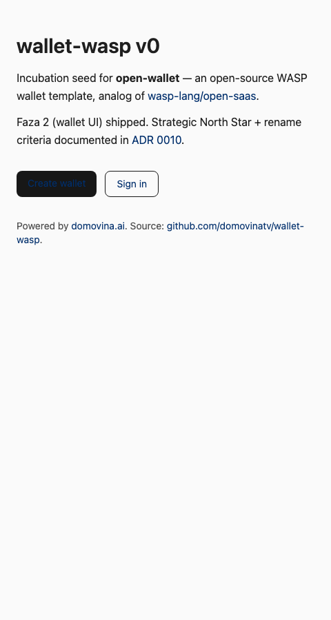
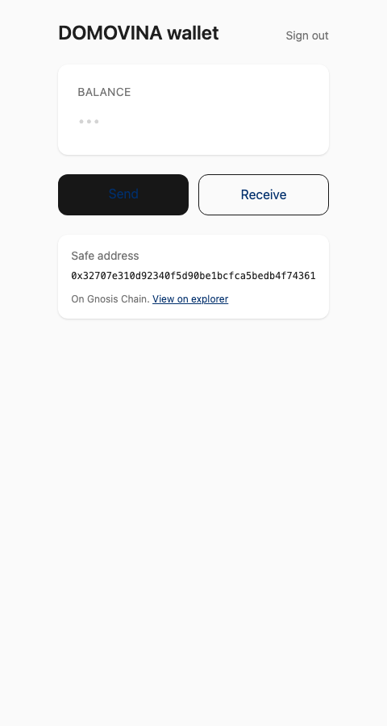
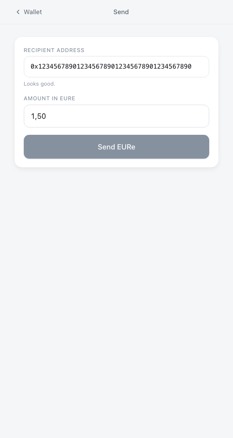
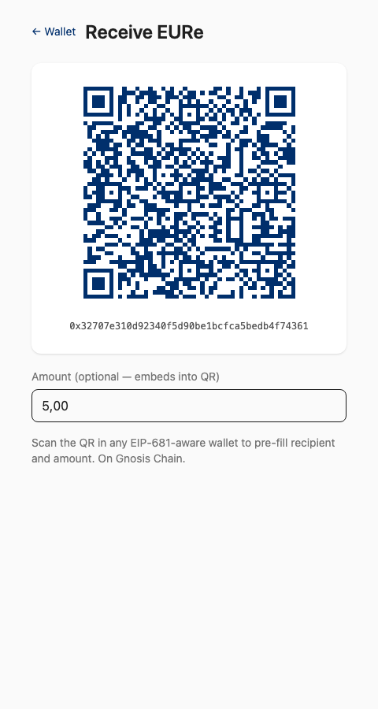

# wallet-wasp — WASP rewrite eksperiment

**Powered by [domovina.ai](https://domovina.ai)** · Standalone WASP-language
rewrite of the production [wallet.domovina.ai](https://wallet.domovina.ai)
(passkey-owned Safe self-custody wallet on Gnosis).

> **North Star — open-wallet**
>
> Ovaj repo je **incubation seed** za potencijalni `open-wallet` template
> po uzoru na [wasp-lang/open-saas](https://github.com/wasp-lang/open-saas):
> oficijelni WASP-blessed open-source šablon, ali za self-custody Web3
> wallet umjesto za SaaS. Po uspješnoj incubation fazi rename → release
> pod `domovinatv/open-wallet` (i potencijalno pod `wasp-lang/open-wallet`
> uz WASP team blessing).
>
> Strategijska odluka i kriteriji za rename dokumentirani u
> [ADR 0010](https://github.com/domovinatv/pay.domovina.ai/blob/main/docs/decisions/0010-open-wallet-vision.md).
> Praktične posljedice za code: **bez `domovina`/`DOMOVINA` hard-codeova u
> src/, sve preko brand config-a; generic naming komponenti; pluggable
> attestation providers; configurable chain.**

## What's shipped (MVP)

Passkey-only self-custody wallet, brand-as-data, runs end-to-end against
live Gnosis Chain RPC. All 5 MVP features working with E2E tests passing
(5/5 in 4.7s):

| Route | Component | What it does |
|---|---|---|
| `/` | `HomePage` | Landing with open-wallet North Star + CTA buttons |
| `/register` | `RegisterPage` | Create passkey → server verifies → derives stub Safe addr → persists User + Passkey rows |
| `/login` | `LoginPage` | Use existing passkey → server verifies assertion → returns Safe addr + session |
| `/wallet` | `WalletPage` | EURe balance via viem from Gnosis RPC + Safe address + explorer link |
| `/send` | `SendPage` | Address + amount form → `sendEure` action (currently stub; real relayer broadcast in next phase) |
| `/receive` | `ReceivePage` | EIP-681 QR for ERC-20 transfer, live regen on amount change |

 
 

## Architecture (high-level)

```
src/
├── brand.config.ts        ⬅ ONLY file with brand/chain/token specifics
├── styles.css             Tailwind v4 entry
├── App.tsx                react-router Outlet shell
├── pages/                 HomePage, Register, Login, Wallet, Send, Receive
├── lib/
│   ├── chain.ts           viem publicClient + getTokenBalance
│   └── session.ts         localStorage session marker (UI-only)
├── auth/
│   ├── passkey.ts         4 WASP actions: register/auth × start/finish
│   ├── safeAddress.ts     stub keccak Safe derivation (real CREATE2 next)
│   ├── rp.ts              WebAuthn RP config (env-overridable)
│   └── session.ts         JWT signSession/verifySession
└── relay/
    └── relay.ts           sendEure action (stub; needs RELAYER_PRIVATE_KEY for real broadcast)

schema.prisma              User, Passkey, WebAuthnChallenge
main.wasp                  routes + actions declarations
tests/                     Playwright + Chrome DevTools virtual authenticator
reference/                 nested submodule: production wallet @ pinned SHA
```

## Run locally

Prerequisites: Node 24 LTS (`nvm use` reads `.nvmrc`), Wasp 0.23.

```bash
# Once
nvm use                # picks 24
npm i -g @wasp.sh/wasp-cli@latest
npm i -g @wasp.sh/wasp-cli-darwin-arm64-unknown@0.23.0   # macOS arm64 only — upstream packaging bug
cp .env.server.example .env.server
cp .env.client.example .env.client
wasp db migrate-dev    # apply Prisma migrations

# Every dev session
wasp start             # client on :4000, server on :4001
```

Ports default to 4000/4001 to avoid Docker port-3000 collision common on
dev machines. Override via `.env.server` (`PORT`) and `.env.client`
(`REACT_APP_API_URL`).

## Run tests

```bash
npx playwright install chromium   # once
npx playwright test               # all E2E, ~5s
```

WebAuthn ceremonies use Chrome DevTools' virtual authenticator
(`WebAuthn.addVirtualAuthenticator` over CDP), so no Touch ID / Face ID
prompts. The full register → wallet → send → receive flow is exercised
in `tests/full-flow.spec.ts`.

## What's NOT in this experiment (vs. production wallet)

Out of MVP scope per `docs/plans/wallet-wasp-experiment.md`:

- Multi-passkey peer linking (ADR 0008)
- Cross-TLD iframe SDK (ADR 0009)
- White-label per-brand build pipeline (ADR 0007) — brand-as-data wired,
  per-tenant deploy not
- Phase 5 attestation (ADR 0003–0006) — pluggable interface designed in
  ADR 0010 but no concrete provider implemented yet
- Real relayer broadcast — needs funded EOA via `RELAYER_PRIVATE_KEY`
- Real Safe v1.4.1 CREATE2 derivation — currently stubbed via keccak

## Layout — git submodule context

- `main.wasp`, `schema.prisma`, `src/` — the WASP rewrite
- `reference/` — **frozen specification**: pinned snapshot of the production
  monorepo [`domovinatv/pay.domovina.ai`](https://github.com/domovinatv/pay.domovina.ai)
  at commit [`7e2c6e0`](https://github.com/domovinatv/pay.domovina.ai/tree/7e2c6e0)
  (state right before this experiment started). The actual production
  wallet source we're rewriting lives at [`reference/wallet/`](./reference/wallet).
  This is a nested git submodule — see
  [`feedback_circular_submodule_1to1_fk`](https://github.com/domovinatv/pay.domovina.ai/blob/main/docs/decisions/0010-open-wallet-vision.md)
  for why and how that's safe.

To pull the reference snapshot when cloning:

```bash
git clone --recurse-submodules git@github.com:domovinatv/wallet-wasp.git
# or, after a regular clone:
git submodule update --init
```

## Plan + status

Full plan, MVP scope, phased breakdown, and known risks are documented
in the parent monorepo at
[`docs/plans/wallet-wasp-experiment.md`](https://github.com/domovinatv/pay.domovina.ai/blob/main/docs/plans/wallet-wasp-experiment.md).

Strategic North Star (this becomes `open-wallet`) in
[ADR 0010](https://github.com/domovinatv/pay.domovina.ai/blob/main/docs/decisions/0010-open-wallet-vision.md).

## License

MIT — same as the analog [wasp-lang/open-saas](https://github.com/wasp-lang/open-saas).
