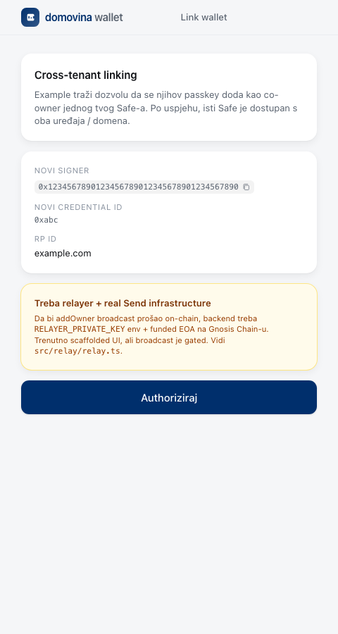
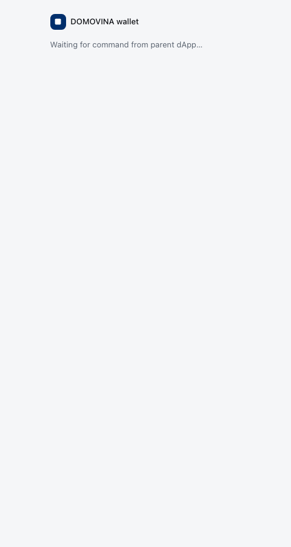

# wallet-wasp — WASP rewrite eksperiment

**Powered by [domovina.ai](https://domovina.ai)** · Standalone WASP-language
rewrite of the production [wallet.domovina.ai](https://wallet.domovina.ai)
(passkey-owned Safe self-custody wallet on Gnosis).

> **North Star — open-wallet**
>
> Ovaj repo je **incubation seed** za potencijalni `open-wallet` template
> po uzoru na [wasp-lang/open-saas](https://github.com/wasp-lang/open-saas):
> oficijelni WASP-blessed open-source šablon, ali za self-custody Web3
> wallet umjesto za SaaS. Po uspješnoj incubation fazi rename → release
> pod `domovinatv/open-wallet` (i potencijalno pod `wasp-lang/open-wallet`
> uz WASP team blessing).
>
> Strategijska odluka i kriteriji za rename dokumentirani u
> [ADR 0010](https://github.com/domovinatv/pay.domovina.ai/blob/main/docs/decisions/0010-open-wallet-vision.md).
> Praktične posljedice za code: **bez `domovina`/`DOMOVINA` hard-codeova u
> src/, sve preko brand config-a; generic naming komponenti; pluggable
> attestation providers; configurable chain.**

## What's shipped (production parity scope)

Passkey-only self-custody wallet on Gnosis Chain, ported 1:1 from the
production `wallet/` source. 13 routes, real Safe v1.4.1 CREATE2
derivation, full ERC-1271 signature encoding, brand-as-data white-label
with 3 sample tenants. 5/5 main E2E tests passing.

| Route | What it does | Status |
|---|---|---|
| `/` | Landing with open-wallet North Star + CTA buttons | ✅ |
| `/register` | Create passkey → real Safe v1.4.1 derivation → DB row | ✅ |
| `/login` | Sign-in via WebAuthn assertion → session token | ✅ |
| `/wallet` | EURe balance + activity feed preview + Send/Receive grid | ✅ |
| `/send` | Address+amount form, recipient chips, deep-link prefill | ✅ stub relay |
| `/receive` | EIP-681 QR (live regen on amount change) | ✅ |
| `/activity` | Full tx history, infinite scroll, day-grouped (Danas/Jučer) | ✅ |
| `/settings` | Account info, security actions, theme picker, signout | ✅ |
| `/settings/expand-access` | Multi-passkey same-Safe per ADR 0008 | 🟡 needs relayer |
| `/settings/phone` | OTP binding via otp.domovina.ai live | 🟡 needs registry proxy |
| `/link` | Cross-TLD authorize page per ADR 0008 | 🟡 needs relayer |
| `/link-callback` | Safari redirect-path finalize | ✅ |
| `/embed` | Iframe SDK target per ADR 0009 | 🟡 needs relayer |

🟡 = UI fully ported with honest "needs RELAYER_PRIVATE_KEY env" banners.
On-chain broadcast unlocks when `.env.server` has a funded EOA private
key. No code changes needed there.

 
 
 
 
 

## White-label per-tenant builds (ADR 0007 + 0010)

3 sample tenant configs in `src/brands/`:

```bash
npm run build:default      # DOMOVINA Wallet (navy + red)
npm run build:sportklub    # SK Wallet (SofaScore blue)
npm run build:zupa         # Župa Wallet (Vatican gold)
```

Selection is build-time via `VITE_BRAND` env, consumed in
`src/brand.config.ts`. To add a new tenant: drop a new file under
`src/brands/`, register in the resolver, add ship script.

Brand audit: `grep -ri "domovina\|DOMOVINA" src/` returns matches ONLY
inside `src/brands/default.ts` (the tenant config itself).

## Architecture (high-level)

```
src/
├── brand.config.ts        ⬅ ONLY file with brand/chain/token specifics
├── styles.css             Tailwind v4 entry
├── App.tsx                react-router Outlet shell
├── pages/                 HomePage, Register, Login, Wallet, Send, Receive
├── lib/
│   ├── chain.ts           viem publicClient + getTokenBalance
│   └── session.ts         localStorage session marker (UI-only)
├── auth/
│   ├── passkey.ts         4 WASP actions: register/auth × start/finish
│   ├── safeAddress.ts     stub keccak Safe derivation (real CREATE2 next)
│   ├── rp.ts              WebAuthn RP config (env-overridable)
│   └── session.ts         JWT signSession/verifySession
└── relay/
    └── relay.ts           sendEure action (stub; needs RELAYER_PRIVATE_KEY for real broadcast)

schema.prisma              User, Passkey, WebAuthnChallenge
main.wasp                  routes + actions declarations
tests/                     Playwright + Chrome DevTools virtual authenticator
reference/                 nested submodule: production wallet @ pinned SHA
```

## Run locally

Prerequisites: Node 24 LTS (`nvm use` reads `.nvmrc`), Wasp 0.23.

```bash
# Once
nvm use                # picks 24
npm i -g @wasp.sh/wasp-cli@latest
npm i -g @wasp.sh/wasp-cli-darwin-arm64-unknown@0.23.0   # macOS arm64 only — upstream packaging bug
cp .env.server.example .env.server
cp .env.client.example .env.client
wasp db migrate-dev    # apply Prisma migrations

# Every dev session
wasp start             # client on :4000, server on :4001
```

Defaults are WASP's 3000 (client) + 3001 (server). If those ports are
taken on your machine, uncomment `PORT` + `WASP_WEB_CLIENT_URL` in
`.env.server` and `REACT_APP_API_URL` in `.env.client`.

## Run tests

```bash
npx playwright install chromium   # once
npx playwright test               # all E2E, ~5s
```

WebAuthn ceremonies use Chrome DevTools' virtual authenticator
(`WebAuthn.addVirtualAuthenticator` over CDP), so no Touch ID / Face ID
prompts. The full register → wallet → send → receive flow is exercised
in `tests/full-flow.spec.ts`.

## What's NOT in this experiment (vs. production wallet)

Out of MVP scope per `docs/plans/wallet-wasp-experiment.md`:

- Multi-passkey peer linking (ADR 0008)
- Cross-TLD iframe SDK (ADR 0009)
- White-label per-brand build pipeline (ADR 0007) — brand-as-data wired,
  per-tenant deploy not
- Phase 5 attestation (ADR 0003–0006) — pluggable interface designed in
  ADR 0010 but no concrete provider implemented yet
- Real relayer broadcast — needs funded EOA via `RELAYER_PRIVATE_KEY`
- Real Safe v1.4.1 CREATE2 derivation — currently stubbed via keccak

## Layout — git submodule context

- `main.wasp`, `schema.prisma`, `src/` — the WASP rewrite
- `reference/` — **frozen specification**: pinned snapshot of the production
  monorepo [`domovinatv/pay.domovina.ai`](https://github.com/domovinatv/pay.domovina.ai)
  at commit [`7e2c6e0`](https://github.com/domovinatv/pay.domovina.ai/tree/7e2c6e0)
  (state right before this experiment started). The actual production
  wallet source we're rewriting lives at [`reference/wallet/`](./reference/wallet).
  This is a nested git submodule — see
  [`feedback_circular_submodule_1to1_fk`](https://github.com/domovinatv/pay.domovina.ai/blob/main/docs/decisions/0010-open-wallet-vision.md)
  for why and how that's safe.

To pull the reference snapshot when cloning:

```bash
git clone --recurse-submodules git@github.com:domovinatv/wallet-wasp.git
# or, after a regular clone:
git submodule update --init
```

## Plan + status

Full plan, MVP scope, phased breakdown, and known risks are documented
in the parent monorepo at
[`docs/plans/wallet-wasp-experiment.md`](https://github.com/domovinatv/pay.domovina.ai/blob/main/docs/plans/wallet-wasp-experiment.md).

Strategic North Star (this becomes `open-wallet`) in
[ADR 0010](https://github.com/domovinatv/pay.domovina.ai/blob/main/docs/decisions/0010-open-wallet-vision.md).

## License

MIT — same as the analog [wasp-lang/open-saas](https://github.com/wasp-lang/open-saas).
